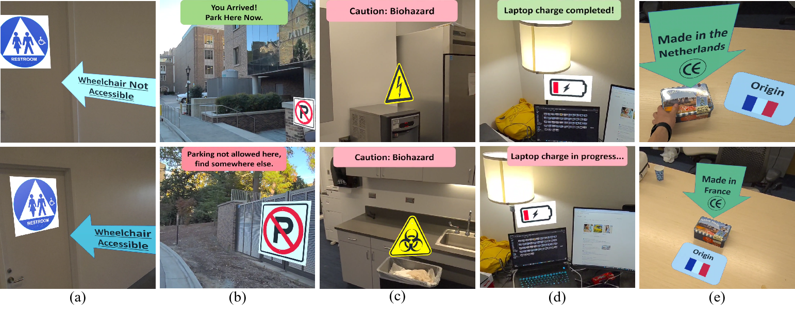

# ContrAR-Dataset

The dataset can be accesssed through this [link](https://drive.google.com/drive/folders/1VxW551dW0hX9zcGNt9Swx44p4zu6jCJL?usp=sharing).

## Dataset Description

This dataset contains augmented videos collected to evaluate systems for detecting contradictory virtual content in augmented reality (AR). Each video captures a real-world AR scene. The dataset is structured around two key dimensions:

  - **AR Application**: what kind of AR scene is presented in the video. We demonstrate 5 typical applications: Indoor Navigation, Outdoor Navigation, Safety Inspection, Smart Apartment, Smart Retail.

  - **Contradcition Status**: whether the virtual content in the video are contradictory with each other. Each video is labeled as either "contradictory" or "not contradictory".

<figure>
  
  <figcaption align="center"> Samples frames from the ContrAR dataset. Each column shows an AR application. The top row shows the contradictory examples. From left to right: (a) Indoor navigation: the text on the virtual arrow indicates the restroom is not accessible, which contradicts with the disabled sign on the virtual restroom sign, potentially avoid the disabled from using the restroom; (b) Outdoor navigation: the text in the virtual dialog box instructs the user to park here, which is contradictory to the information provided by a virtual ``No Parking" sign, leading to potential fines; (c) Safety inspection: the text in the virtual dialog box "Caution: Biohazard" is contradictory with the virtual sign which stands for "Caution: High Voltage", which may confuse the user about the safety regulations in this area; (d) smart apartment: the text in the virtual dialog box indicates the laptop is fully charged, which contradicts the virtual "low battery" sign, which may lead to an early stop of charging; (e) smart retail: the text on the virtual arrow tells the user the box is made in the Netherlands, which contradicts to the label next to the box saying it is from France, which may lead to non-voluntary purchasing behavior. The bottom row shows the non-contradictory examples, where the information provided by different virtual content aligned with each other.</figcaption>
</figure>

### Dataset Usage

The ContrAR dataset serves as a benchmark for evaluating systems that detect contradictory virtual content attacks in AR applications. These systems are crucial for protecting user safety and experience. We evaluated 11 vision–language–model–based detection systems on ContrAR. The results show that although state-of-the-art VLMs achieve reasonable detection accuracy, their performance still leaves room for improvement, indicating that the challenge posed by our dataset is non-trivial.

<figure>
  
  <figcaption align="center"> </figcaption>
</figure>

